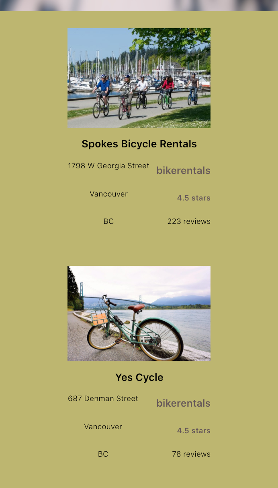

# Yelp data retriever

This ReactJS application utilizes the Yelp Fusion API to gather data. According to the users inputs, it constucts a corresponding
API url and sends a HTTP GET method using asyncronous programming. The data fetched is then further parsed and filtered 
for better visibility. 

## Screenshots

## Running the application:

### `yarn start`

Runs the app in the development mode. 
Open [http://localhost:3000](http://localhost:3000) to view it in the browser.

The page will reload if you make edits. 
You will also see any lint errors in the console.

